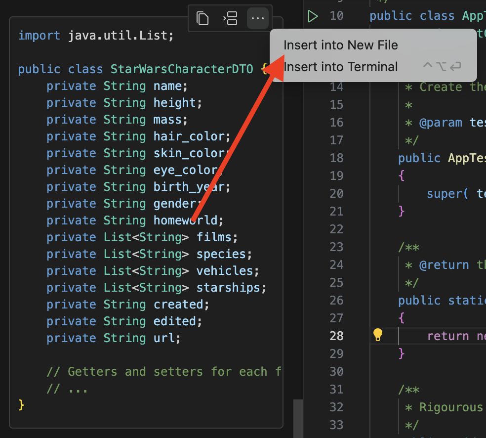
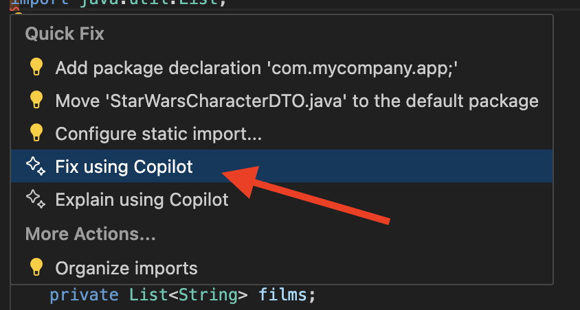
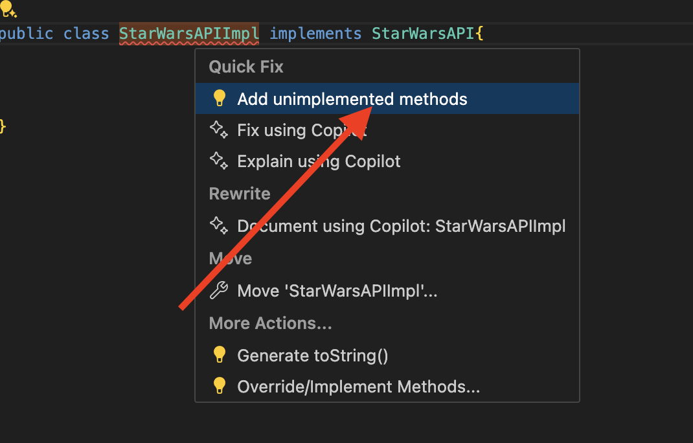
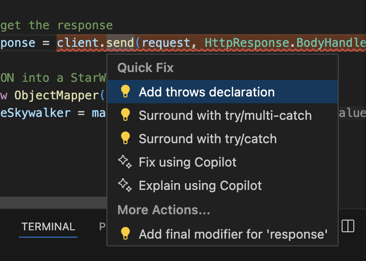

# Star Wars API with Java

<!-- REPLACE THE TITLE WITH THE NAME OF THE EXERCISE -->

This repository includes a Github Copilot training intended to show off a very practical example using the tool.
We will leverage the Java programming language to query the Star Wars API at https://swapi.info and retrieve information about the Star Wars characters.
Within this training we will try to cover the whole lifecycle of a Java application. Starting from creating a Maven based Java project, writing tests, implementing the application, and running the tests. Even a small refactoring will be covered.

## 🎯 Goal

We will step by step implement a Java application to see how we can leverage Github Copilot to help us write the code:

- **Generating a DTO class for the Star Wars Person**
- **Creating an interface to query the Star Wars API**
- **Implementing the interface with the Java HttpClient**
- **Writing tests for the interface**
- **Adding more asserts to the tests**
- **Adding additional characters to the StarWarsAPI interface**

## 📚 Quick Navigation
- [Star Wars API with Java](#star-wars-api-with-java)
  - [🎯 Goal](#-goal)
  - [📚 Quick Navigation](#-quick-navigation)
  - [✍️ Programming Languages](#️-programming-languages)
  - [💻 IDE](#-ide)
  - [🗒️ Guide](#️-guide)
    - [Create the project](#create-the-project)
      - [Solution](#solution)
    - [Check if the tests compile](#check-if-the-tests-compile)
      - [Solution](#solution-1)
    - [Upgrade JUnit to Junit4 in your pom.xml](#upgrade-junit-to-junit4-in-your-pomxml)
      - [Solution](#solution-2)
    - [Refactor the tests to use Junit 4](#refactor-the-tests-to-use-junit-4)
      - [Solution](#solution-3)
    - [Create a Star Wars Person DTO class](#create-a-star-wars-person-dto-class)
      - [Solution](#solution-4)
    - [Fixing error in the StarWarsCharacterDTO class](#fixing-error-in-the-starwarscharacterdto-class)
      - [Solution](#solution-5)
    - [Generating Getters and Setters with VS Code](#generating-getters-and-setters-with-vs-code)
      - [Solution](#solution-6)
    - [Creating the interface to query the Star Wars API](#creating-the-interface-to-query-the-star-wars-api)
      - [Solution](#solution-7)
    - [Generate a test for the StarWarsAPI interface](#generate-a-test-for-the-starwarsapi-interface)
      - [Solution](#solution-8)
    - [Create the StarWarsAPIImpl class](#create-the-starwarsapiimpl-class)
      - [Solution](#solution-9)
    - [Implement the getLukeSkywalker method with http client](#implement-the-getlukeskywalker-method-with-http-client)
      - [Solution](#solution-10)
    - [Fixing the ObjectMapper error](#fixing-the-objectmapper-error)
      - [Solution](#solution-11)
    - [Fixing the InterruptedException error](#fixing-the-interruptedexception-error)
      - [Solution](#solution-12)
    - [Run the tests](#run-the-tests)
      - [Solution](#solution-13)
    - [Adding more Asserts to the test](#adding-more-asserts-to-the-test)
      - [Solution](#solution-14)
    - [Add additional characters to the StarWarsAPI interface](#add-additional-characters-to-the-starwarsapi-interface)
      - [Solution](#solution-15)
    - [Implement the getDarthVader method in the StarWarsAPIImpl class](#implement-the-getdarthvader-method-in-the-starwarsapiimpl-class)
      - [Solution](#solution-16)
    - [Add a test for the getDarthVader method](#add-a-test-for-the-getdarthvader-method)
      - [Solution](#solution-17)
    - [Refactor the StarWarsAPI implementation](#refactor-the-starwarsapi-implementation)
      - [Solution](#solution-18)
  - [Summary](#summary)

## ✍️ Programming Languages

- Java

## 💻 IDE

<!-- OPTIONALLY SPECIFY THE IDE THAT SHOULD BE USED -->

* OpenJDK: [OpenJDK JDK 21.0.2 GA Release (java.net)](https://jdk.java.net/21/)
* Maven: [Maven – Installing Apache Maven](https://maven.apache.org/install.html)
* VSCode: [https://code.visualstudio.com/](https://code.visualstudio.com/)
* Github Copilot: [GitHub Copilot - Visual Studio Marketplace](https://marketplace.visualstudio.com/items?itemName=GitHub.copilot)
* Java Extensions Pack: [Extension Pack for Java - Visual Studio Marketplace](https://marketplace.visualstudio.com/items?itemName=vscjava.vscode-java-pack)

## 🗒️ Guide

<!-- STEP BY STEP ISNTRUCTIONS DETAILING HOW TO COMPLETE THE EXERCISE -->

Within the next steps we will create a Java application that will query the Star Wars API and retrieve information about the Star Wars characters.
We will leverage Github Copilot to help us write the code and get started.

### Create the project

First of all it is necessary to have a folder created in which you will create the project. Navigate to this folder via terminal and run the following command:

```bash
code .
```

We need to create a Maven based Java project. For this we will have to ask Github Copilot to give us a good overview of how to do it.

> [!IMPORTANT]
> Ask Github Copilot Chat to provide you with the steps to create a Maven based Java project.

> [!TIP]
> An example prompt could be: ``How can I create via terminal a Java based project that already has some unit tests?``

Remember hat you can directly copy commands from the chat and paste them into the terminal using the terminal icon:


#### Solution

Create an empty folder and navigate to it via terminal. Then run the following command:

```bash
mvn archetype:generate -DgroupId=com.mycompany.app -DartifactId=my-app -DarchetypeArtifactId=maven-archetype-quickstart -DinteractiveMode=false
```

### Check if the tests compile

> [!IMPORTANT]
> Ask Github Copilot to provide you with the command to compile the tests.

> [!TIP]
> Another prompt: ``How can I use maven to run the tests?``

#### Solution

Navigate in the folder where the project was created and run the following command:

```bash
mvn test
```

You should see the following output:

```bash
[INFO]
[INFO] Tests run: 1, Failures: 0, Errors: 0, Skipped: 0
[INFO] ------------------------------------------------------------------------
[INFO] BUILD SUCCESS
[INFO] ------------------------------------------------------------------------
[INFO] Total time:  1.682 s
```

### Upgrade JUnit to Junit4 in your pom.xml

> [!IMPORTANT]
> Ask Github Copilot how you can leverage Junit 4 instead of Junit 3. Open your `pom.xml` in an editor. Use the command pop up to interact with Copilot Chat here.
> After you have altered the `pom.xml` file, run the tests again to make sure everything is working as expected.

> [!TIP]
> Prompt: ``I would like to use Junit 4. What do I have to alter?``

#### Solution

Your `pom.xml` dependencies should look like this:

```xml
  <dependencies>
    <dependency>
      <groupId>junit</groupId>
      <artifactId>junit</artifactId>
      <version>4.13.2</version>
      <scope>test</scope>
    </dependency>
  </dependencies>
```

### Refactor the tests to use Junit 4

> [!IMPORTANT]
> Ask Github Copilot to provide you with the necessary imports to use Junit 4 in your tests. Open your `AppTest.java` file in an editor and use Copilot Chat with an appropriate prompt to refactor the class.

> [!TIP]
> Prompt: ``I would like to refactor the tests to use Junit 4 and one basic test. The test should leverage the @Test annotation. Can you help me with the imports and the overall class structure?``

#### Solution

Your `AppTest.java` file should look like this. Be careful with the package name, **it should match the one you used when creating the project**.

```java

package com.mycompany.app;

import org.junit.Test;
import static org.junit.Assert.*;

/**
 * Unit test for simple App.
 */
public class AppTest 
{
   
    @Test
    public void testApp()
    {
        assertTrue( true );
    }
}

```

### Create a Star Wars Person DTO class

Please navigate in your browser to the [Star Wars API](https://swapi.info/) and get familiar with the API. We will create a DTO class to represent a Star Wars Person.
Let's start by using Luke Skywalker as an example: https://swapi.info/people/1

You can see the example payload directly at the page. Please copy the JSON in your clipboard.

```json
{  
    "name": "Luke Skywalker",
    "height": "172",
    "mass": "77",
    "hair_color": "blond",
    "skin_color": "fair",
    "eye_color": "blue",
    "birth_year": "19BBY",
    "gender": "male",
    "homeworld": "https://swapi.info/api/planets/1",
    "films": [
        "https://swapi.info/api/films/1",
        "https://swapi.info/api/films/2",
        "https://swapi.info/api/films/3",
        "https://swapi.info/api/films/6"
    ],
    "species": [],
    "vehicles": [
        "https://swapi.info/api/vehicles/14",
        "https://swapi.info/api/vehicles/30"
    ],
    "starships": [
        "https://swapi.info/api/starships/12",
        "https://swapi.info/api/starships/22"
    ],
    "created": "2014-12-09T13:50:51.644000Z",
    "edited": "2014-12-20T21:17:56.891000Z",
    "url": "https://swapi.info/api/people/1"
}
```

> [!IMPORTANT]
> Use Github Copilot chat to create a DTO class for the Star Wars Person. You can use the JSON payload above as an example payload within the prompt.

> [!TIP]
> Prompt:
>
> ```plaintext
>
> Can you help me create a DTO class that is returned by the public Star Wars API. One example looks like this:  
>
> --- JSON PAYLOAD --- 
>
> { "name": "Luke Skywalker", "height": "172", "mass": "77", "hair_color": "blond", "skin_color": "fair", "eye_color": "blue", "birth_year": "19BBY", "gender": "male", "homeworld": "https://swapi.info/api/planets/1", "films": [ "https://swapi.info/api/films/1", "https://swapi.info/api/films/2", "https://swapi.info/api/films/3", "https://swapi.info/api/films/6" ], "species": [], "vehicles": [ "https://swapi.info/api/vehicles/14", "https://swapi.info/api/vehicles/30" ], "starships": [ "https://swapi.info/api/starships/12", "https://swapi.info/api/starships/22" ], "created": "2014-12-09T13:50:51.644000Z", "edited": "2014-12-20T21:17:56.891000Z", "url": "https://swapi.info/api/people/1" }
> ---
> ```
>
> Remember that you can directly create files out of copilot chat by clicking on the file icon.
> 

#### Solution

Your DTO class should look like this:

```java
import java.util.List;

public class StarWarsCharacterDTO {
    private String name;
    private String height;
    private String mass;
    private String hair_color;
    private String skin_color;
    private String eye_color;
    private String birth_year;
    private String gender;
    private String homeworld;
    private List<String> films;
    private List<String> species;
    private List<String> vehicles;
    private List<String> starships;
    private String created;
    private String edited;
    private String url;

    // Getters and setters for each field
    // ...
}
```

Remember that this file needs to be stored in the same folder like your `App.java` file. **The file needs to have the same filename as the class name** (eg `StarWarsCharacterDTO.java` in this example!).

### Fixing error in the StarWarsCharacterDTO class

Your DTO class seems to have an error as something is underlined in red. Please ask Github Copilot to help you fix the error.

> [!IMPORTANT]
> Press ``CMD + .`` to open the quick fix menu and use the Github Copilot to fix the error.

> [!TIP]
> The fix can be found here:
> 
>
> Accept the suggestion of Github Copilot.

#### Solution

The error should be fixed now. And the `StarWarsCharacterDTO.java` file looks like this:

```java
package com.mycompany.app;

import java.util.List;

public class StarWarsCharacterDTO {
    private String name;
    private String height;
    private String mass;
    private String hair_color;
    private String skin_color;
    private String eye_color;
    private String birth_year;
    private String gender;
    private String homeworld;
    private List<String> films;
    private List<String> species;
    private List<String> vehicles;
    private List<String> starships;
    private String created;
    private String edited;
    private String url;

    // Getters and setters for each field
    // ...
}
```

### Generating Getters and Setters with VS Code

You can use the VS Code feature to generate getters and setters for the fields in the `StarWarsCharacterDTO` class. Click in the class and press ``CMD + .`` to open the quick fix menu. Then select the option to generate getters and setters.

#### Solution

Your `StarWarsCharacterDTO.java` file should look like this:

```java

package com.mycompany.app;

import java.util.List;

public class StarWarsCharacterDTO {
    private String name;
    private String height;
    private String mass;
    private String hair_color;
    private String skin_color;
    private String eye_color;
    private String birth_year;
    private String gender;
    private String homeworld;
    private List<String> films;
    private List<String> species;
    private List<String> vehicles;
    private List<String> starships;
    private String created;
    private String edited;
    private String url;

    public String getName() {
        return name;
    }
    public void setName(String name) {
        this.name = name;
    }
    public String getHeight() {
        return height;
    }
    public void setHeight(String height) {
        this.height = height;
    }
    public String getMass() {
        return mass;
    }
    public void setMass(String mass) {
        this.mass = mass;
    }
    public String getHair_color() {
        return hair_color;
    }
    public void setHair_color(String hair_color) {
        this.hair_color = hair_color;
    }
    public String getSkin_color() {
        return skin_color;
    }
    public void setSkin_color(String skin_color) {
        this.skin_color = skin_color;
    }
    public String getEye_color() {
        return eye_color;
    }
    public void setEye_color(String eye_color) {
        this.eye_color = eye_color;
    }
    public String getBirth_year() {
        return birth_year;
    }
    public void setBirth_year(String birth_year) {
        this.birth_year = birth_year;
    }
    public String getGender() {
        return gender;
    }
    public void setGender(String gender) {
        this.gender = gender;
    }
    public String getHomeworld() {
        return homeworld;
    }
    public void setHomeworld(String homeworld) {
        this.homeworld = homeworld;
    }
    public List<String> getFilms() {
        return films;
    }
    public void setFilms(List<String> films) {
        this.films = films;
    }
    public List<String> getSpecies() {
        return species;
    }
    public void setSpecies(List<String> species) {
        this.species = species;
    }
    public List<String> getVehicles() {
        return vehicles;
    }
    public void setVehicles(List<String> vehicles) {
        this.vehicles = vehicles;
    }
    public List<String> getStarships() {
        return starships;
    }
    public void setStarships(List<String> starships) {
        this.starships = starships;
    }
    public String getCreated() {
        return created;
    }
    public void setCreated(String created) {
        this.created = created;
    }
    public String getEdited() {
        return edited;
    }
    public void setEdited(String edited) {
        this.edited = edited;
    }
    public String getUrl() {
        return url;
    }
    public void setUrl(String url) {
        this.url = url;
    }
}

```

### Creating the interface to query the Star Wars API

We will create an interface that will be used to query the Star Wars API. The interface will have a method that will return a `StarWarsCharacterDTO` object. As we need to have a start we will use the Luke Skywalker example and also use a method to query specificly for Luke Skywalker.

> [!IMPORTANT]
> Create a new file called `StarWarsAPI.java` in the same folder as your `App.java` file. If you have problems creating this file then use the Github Copilot chat to help you create the file. We need to have a method that returns Luke Skywalker as an `StarWarsCharacterDTO` object.

> [!TIP]
> Prompt: ``Can you help me create a plain java interface that queries the Star Wars API and returns a StarWarsCharacterDTO object? I would like to start with just one method for querying Luke Skywalker. The interface should be called StarWarsAPI.``

#### Solution

Your `StarWarsAPI.java` file should look like this and been stored in the same folder like your `App.java` and `StarWarsCharacterDTO.java` file:

```java
package com.mycompany.app;

import java.io.IOException;

public interface StarWarsAPI {
    StarWarsCharacterDTO getLukeSkywalker() throws IOException;
}
```

### Generate a test for the StarWarsAPI interface

We will now create a test for the `StarWarsAPI` interface. The test will be used to verify that the interface is working as expected. We will use Junit 4 to create the test.

> [!IMPORTANT]
> Use the Github Copilot chat to create a test for the `StarWarsAPI` interface. The test should verify that the `getLukeSkywalker` method is working as expected. The test should be stored in the same folder like your `AppTest.java` file.

> [!TIP]
> Use the Github Copilot popup to create the test. Leverage the ``/tests`` command to let Copilot generate the test for you. An example prompt could be: ``/tests Create a test that is checking if the retrieved object from the Star Wars API is fine.`` Accept the suggestion of Copilot and store the file next to your `AppTest.java` file as ``StarWarsAPITest.java`` file.
> Careful: Most likely you will have to adjust the package name in the generated test file and import the IOException. You can use the quick fix menu to do so with Github Copilot.

#### Solution

Your `StarWarsAPITest.java` file should look like this:

```java
package com.mycompany.app;

import org.junit.Test;
import static org.junit.Assert.*;

import java.io.IOException;

public class StarWarsAPITest {

    @Test
    public void testGetLukeSkywalker() {
        StarWarsAPI starWarsAPI = new StarWarsAPIImpl();
        try {
            StarWarsCharacterDTO lukeSkywalker = starWarsAPI.getLukeSkywalker();
            assertNotNull(lukeSkywalker);
        } catch (IOException e) {
            fail("IOException occurred: " + e.getMessage());
        }
    }
}
```

You will see that the `StarWarsAPIImpl` class is not yet created. And that we still have compilation errors. We will fix this in the next steps.

### Create the StarWarsAPIImpl class

We will now create the `StarWarsAPIImpl` class that implements the `StarWarsAPI` interface. The class will have a method that will return a `StarWarsCharacterDTO` object. As we need to have a start we will use the Luke Skywalker example and also use a method to query specificly for Luke Skywalker.

> [!IMPORTANT]
> Create a new file called `StarWarsAPIImpl.java` in the same folder as your `App.java` file. Use VSCode to create this!
> The File will look like this:

```java
public class StarWarsAPIImpl  {

}
```

> Use the auto completion feature of VSCode to implement the interface. ** Move the cursor behind the class name and press space. You should see ``implements StarWarsAPI``. Press tab to accept the suggestion. **
> The file should look like this:

```java
public class StarWarsAPIImpl implements StarWarsAPI {

}
```

> Now we will implement the method. Just move the cursor on the class name and use the quick fix menu to implement the method.
> 

#### Solution

Your `StarWarsAPIImpl.java` file should look like this:

```java
package com.mycompany.app;

import java.io.IOException;

public class StarWarsAPIImpl implements StarWarsAPI{

    @Override
    public StarWarsCharacterDTO getLukeSkywalker() throws IOException {
        // TODO Auto-generated method stub
        throw new UnsupportedOperationException("Unimplemented method 'getLukeSkywalker'");
    }  
  
}
```

Your error in the `StarWarsAPITest.java` file should be gone now. Run the tests again to make sure everything is working as expected. **The tests should fail.**

### Implement the getLukeSkywalker method with http client

We will now implement the `getLukeSkywalker` method in the `StarWarsAPIImpl` class. We will use the Java `HttpClient` to query the Star Wars API and retrieve the information about Luke Skywalker from the url: https://swapi.info/api/people/1

> [!IMPORTANT]
> Click in the body of the `getLukeSkywalker` method and use iterative prompting to
>
> - instantiate a `HttpClient` object
> - create a `HttpRequest` object using the `GET` method and the url `https://swapi.info/api/people/1`
> - send the request and retrieve the response
> - parse the response body to a `StarWarsCharacterDTO` object
> - return the `StarWarsCharacterDTO` object

> [!TIP]
> Use the iterative prompting to implement the method. You can use the following prompts one by one to implement the method. Accept the suggestions by pressing `tab`:
>
> - ``// Use Java HttpClient to make a GET request to the Star Wars API // The URL to get Luke Skywalker is https://swapi.info/api/people/1 // Create a new instance of HttpClient``
> - ``// Create a new instance of HttpRequest``
> - ``// Send the request and retrieve the response``
> - ``// Parse the response body to a StarWarsCharacterDTO object``
> - ``// Return the StarWarsCharacterDTO object``

#### Solution

Your `StarWarsAPIImpl.java` file should look like this:

```java
package com.mycompany.app;

import java.io.IOException;
import java.net.URI;
import java.net.http.HttpClient; // Import the HttpClient class
import java.net.http.HttpRequest;
import java.net.http.HttpResponse;

public class StarWarsAPIImpl implements StarWarsAPI{

    @Override
    public StarWarsCharacterDTO getLukeSkywalker() throws IOException {
   
        // Use Java HttpClient to make a GET request to the Star Wars API
        // The URL to get Luke Skywalker is https://swapi.info/api/people/1
        // Create a new instance of HttpClient
        HttpClient client = HttpClient.newHttpClient();

        // Create a new instance of HttpRequest
        HttpRequest request = HttpRequest.newBuilder()
            .uri(URI.create("https://swapi.info/api/people/1"))
            .build();

        // Send the request and get the response
        HttpResponse<String> response = client.send(request, HttpResponse.BodyHandlers.ofString());

        // Parse the response JSON into a StarWarsCharacterDTO object
        ObjectMapper mapper = new ObjectMapper();
        StarWarsCharacterDTO lukeSkywalker = mapper.readValue(response.body(), StarWarsCharacterDTO.class);

        return lukeSkywalker;
    

    }  
  
}
```

You will see that there is an **error** with the `ObjectMapper` class. We will fix this in the next steps.

### Fixing the ObjectMapper error

The `ObjectMapper` class is not yet imported. But even then we need to add the `jackson-databind` dependency to the `pom.xml` file. Use the Github Copilot to help with this.

> [!IMPORTANT]
>
> - Use Github Copilot to generate the import in your `StarWarsAPIImpl.java` file to ``import com.fasterxml.jackson.databind.ObjectMapper;``
> - Use Github Copilot to generate the dependency in your `pom.xml` file to ``com.fasterxml.jackson.core:jackson-databind:2.13.0``

> [!TIP]
>
> - Use Github Copilot ``/fix`` command to fix the error in the `StarWarsAPIImpl.java` file. You can also use the right click menu to fix the error.
> - Ask Github Copilot Chat to provide you with the necessary dependency for the `pom.xml` file. A prompt could be: ``I need to add the jackson-databind dependency to the pom.xml file. Can you help me with this?``
>   A popup from the Java Extension Pack will appear. Accept the suggestion to rebuild the Java Class Path.

#### Solution

Your `StarWarsAPIImpl.java` file should look like this:

```java
package com.mycompany.app;

import java.io.IOException;
import java.net.URI;
import java.net.http.HttpClient; // Import the HttpClient class
import java.net.http.HttpRequest;
import java.net.http.HttpResponse;
import com.fasterxml.jackson.databind.ObjectMapper;

public class StarWarsAPIImpl implements StarWarsAPI{

    @Override
    public StarWarsCharacterDTO getLukeSkywalker() throws IOException {
   
        // Use Java HttpClient to make a GET request to the Star Wars API
        // The URL to get Luke Skywalker is https://swapi.info/api/people/1

        // Create a new instance of HttpClient
        HttpClient client = HttpClient.newHttpClient();

        // Create a new instance of HttpRequest
        HttpRequest request = HttpRequest.newBuilder()
            .uri(URI.create("https://swapi.info/api/people/1"))
            .build();

        // Send the request and get the response
        HttpResponse<String> response = client.send(request, HttpResponse.BodyHandlers.ofString());

        // Parse the response JSON into a StarWarsCharacterDTO object
        ObjectMapper mapper = new ObjectMapper();
        StarWarsCharacterDTO lukeSkywalker = mapper.readValue(response.body(), StarWarsCharacterDTO.class);

        return lukeSkywalker;
    

    }  
  
}
```

Your `pom.xml` file should look like this:

```xml
<project xmlns="http://maven.apache.org/POM/4.0.0"
  xmlns:xsi="http://www.w3.org/2001/XMLSchema-instance"
  xsi:schemaLocation="http://maven.apache.org/POM/4.0.0 http://maven.apache.org/maven-v4_0_0.xsd">
  <modelVersion>4.0.0</modelVersion>
  <groupId>com.mycompany.app</groupId>
  <artifactId>my-app</artifactId>
  <packaging>jar</packaging>
  <version>1.0-SNAPSHOT</version>
  <name>my-app</name>
  <url>http://maven.apache.org</url>
  <dependencies>
    <dependency>
      <groupId>junit</groupId>
      <artifactId>junit</artifactId>
      <version>4.13.2</version>
      <scope>test</scope>
    </dependency>
    <!-- Add this block for jackson-databind -->
    <dependency>
      <groupId>com.fasterxml.jackson.core</groupId>
      <artifactId>jackson-databind</artifactId>
      <version>2.13.0</version>
    </dependency>
  </dependencies>
</project>
```

Nevertheless there is now a new error in the `StarWarsAPIImpl.java` file. We will fix this in the next steps.

### Fixing the InterruptedException error

The `getLukeSkywalker` method throws an `IOException`. But the `HttpClient` class also throws an `InterruptedException`. We will fix this by adding the `InterruptedException` to the `throws` clause of the method. This also means that we need to add the `InterruptedException` to the `throws` clause of the `getLukeSkywalker` method in the `StarWarsAPI` interface. And afterwards to the **try/catch** block in the `StarWarsAPITest.java` file.

> [!IMPORTANT]
> Use the Quick Fix menu (`CMD+.`) to add the `InterruptedException` to the `throws` clause of the `getLukeSkywalker` method.
> 
> Use the Quick Fix menu (`CMD+.`) to add the `InterruptedException` to the `throws` clause of the `getLukeSkywalker` method in the `StarWarsAPI` interface.
> 
> Use the Quick Fix menu (`CMD+.`) to add the `InterruptedException` to the `try/catch` block in the `StarWarsAPITest.java` file.
> 

#### Solution

Your `StarWarsAPIImpl.java` file should look like this:

```java
package com.mycompany.app;

import java.io.IOException;
import java.net.URI;
import java.net.http.HttpClient; // Import the HttpClient class
import java.net.http.HttpRequest;
import java.net.http.HttpResponse;
import com.fasterxml.jackson.databind.ObjectMapper;

public class StarWarsAPIImpl implements StarWarsAPI{

    @Override
    public StarWarsCharacterDTO getLukeSkywalker() throws IOException, InterruptedException {
   
        // Use Java HttpClient to make a GET request to the Star Wars API
        // The URL to get Luke Skywalker is https://swapi.info/api/people/1

        // Create a new instance of HttpClient
        HttpClient client = HttpClient.newHttpClient();

        // Create a new instance of HttpRequest
        HttpRequest request = HttpRequest.newBuilder()
            .uri(URI.create("https://swapi.info/api/people/1"))
            .build();

        // Send the request and get the response
        HttpResponse<String> response = client.send(request, HttpResponse.BodyHandlers.ofString());

        // Parse the response JSON into a StarWarsCharacterDTO object
        ObjectMapper mapper = new ObjectMapper();
        StarWarsCharacterDTO lukeSkywalker = mapper.readValue(response.body(), StarWarsCharacterDTO.class);

        return lukeSkywalker;
    

    }  
  
}
```

Your `StarWarsAPI.java` file should look like this:

```java
package com.mycompany.app;

import java.io.IOException;

public interface StarWarsAPI {

    StarWarsCharacterDTO getLukeSkywalker() throws IOException, InterruptedException;

}
```

Your `StarWarsAPITest.java` file should look like this:

```java
package com.mycompany.app;

import org.junit.Test;
import static org.junit.Assert.*;

import java.io.IOException;

public class StarWarsAPITest {

    @Test
    public void testGetLukeSkywalker() {

        StarWarsAPI starWarsAPI = new StarWarsAPIImpl();
        try {
            StarWarsCharacterDTO lukeSkywalker = starWarsAPI.getLukeSkywalker();
            assertNotNull(lukeSkywalker);
        } catch (IOException | InterruptedException e) {
            fail("IOException occurred: " + e.getMessage());
        }
    }
}

```

### Run the tests

Run the tests again to make sure everything is working as expected. **The tests will now fail** with

```plaintext
[ERROR] Failures: 
[ERROR]    StarWarsAPITest.testGetLukeSkywalker:20 IOException occurred: No content to map due to end-of-input
 at [Source: (String)""; line: 1, column: 0]
```

> [!IMPORTANT]
>
> - Ask Github Copilot to provide you with the necessary code to fix the error. The hint might be not enough.
> - Go in your browser. Open the network tab in the developer tools. And visit the url `https://swapi.info/api/people/1`. Look at the network and use this info to fix the error.

> [!TIP]
>
> - Open the `StarWarsAPIImpl.java` file. Go in Github Copilot chat and ask for help to fix the error: ``When visiting the url https://swapi.info/api/people/1 I see in my network tab of the dev consoles in my browser a 308. Does this lead to an error in my test?``
> - Replace the instance of the `HttpClient` with the following code: ``HttpClient client = HttpClient.newBuilder().followRedirects(HttpClient.Redirect.ALWAYS).build();``
> - Rerun the tests to make sure everything is working as expected: ``mvn test``

#### Solution

Your `StarWarsAPIImpl.java` file should look like this:

```java
package com.mycompany.app;

import java.io.IOException;
import java.net.URI;
import java.net.http.HttpClient; // Import the HttpClient class
import java.net.http.HttpRequest;
import java.net.http.HttpResponse;
import com.fasterxml.jackson.databind.ObjectMapper;

public class StarWarsAPIImpl implements StarWarsAPI{

    @Override
    public StarWarsCharacterDTO getLukeSkywalker() throws IOException, InterruptedException {
   
        // Use Java HttpClient to make a GET request to the Star Wars API
        // The URL to get Luke Skywalker is https://swapi.info/api/people/1

        // Create a new instance of HttpClient
        HttpClient client = HttpClient.newBuilder()
            .followRedirects(HttpClient.Redirect.ALWAYS)
            .build();

        // Create a new instance of HttpRequest
        HttpRequest request = HttpRequest.newBuilder()
            .uri(URI.create("https://swapi.info/api/people/1"))
            .build();

        // Send the request and get the response
        HttpResponse<String> response = client.send(request, HttpResponse.BodyHandlers.ofString());

        // Parse the response JSON into a StarWarsCharacterDTO object
        ObjectMapper mapper = new ObjectMapper();
        StarWarsCharacterDTO lukeSkywalker = mapper.readValue(response.body(), StarWarsCharacterDTO.class);

        return lukeSkywalker;
    

    }  
  
}
```

### Adding more Asserts to the test

We need to add a little more asserts to the test to check if the information about Luke Skywalker is correct. We will check if the name of Luke Skywalker is correct and if the height is correct.

> [!IMPORTANT]
>
> - Open the `StarWarsAPITest.java` file.
> - Use comments as prompts after the `assertNotNull` line to ask Github Copilot to provide you with the necessary code to check if the name of Luke Skywalker is correct and if the height is correct.

> [!TIP]
>
> - Use the following prompts as comments to ask Github Copilot to provide you with the necessary code. Press enter after the comment and Tab to accept the suggestion.
> - - ``// Check if the name of Luke Skywalker is correct``
> - - ``// Check if the height of Luke Skywalker is correct``

#### Solution

Your `StarWarsAPITest.java` file should look like this:

```java
package com.mycompany.app;

import org.junit.Test;
import static org.junit.Assert.*;

import java.io.IOException;

public class StarWarsAPITest {

    @Test
    public void testGetLukeSkywalker() {

        StarWarsAPI starWarsAPI = new StarWarsAPIImpl();
        try {
            StarWarsCharacterDTO lukeSkywalker = starWarsAPI.getLukeSkywalker();
            assertNotNull(lukeSkywalker);

            // Check if the name of Like Skywalker is correct
            assertEquals("Luke Skywalker", lukeSkywalker.getName());

            // Check if the height of Luke Skywalker is correct
            assertEquals("172", lukeSkywalker.getHeight());

        } catch (IOException | InterruptedException e) {
            fail("IOException occurred: " + e.getMessage());
        }
    }
}
```

### Add additional characters to the StarWarsAPI interface

Now that we have implemented the `getLukeSkywalker` method we will add additional methods to the `StarWarsAPI` interface to query other Star Wars characters. We will now query for our beloved Darth Vader.

> [!IMPORTANT]
> Add a new method to the `StarWarsAPI` interface that will return a `StarWarsCharacterDTO` object for Darth Vader. Use a comment as a prompt to do so

> [!TIP]
> Use the following prompt as a comment to ask Github Copilot to provide you with the necessary code. Press enter after the comment and Tab to accept the suggestion: ``// Get Darth Vader``

#### Solution

Your `StarWarsAPI.java` file should look like this:

```java

package com.mycompany.app;

import java.io.IOException;

public interface StarWarsAPI {

    StarWarsCharacterDTO getLukeSkywalker() throws IOException, InterruptedException;
    // Get Darth Vader
    StarWarsCharacterDTO getDarthVader() throws IOException, InterruptedException;
}
```

This will lead to a compile error in the StarWarsAPIImpl class. We will fix this in the next steps.

### Implement the getDarthVader method in the StarWarsAPIImpl class

We will now implement the `getDarthVader` method in the `StarWarsAPIImpl` class. We will use the Java `HttpClient` to query the Star Wars API and retrieve the information about Darth Vader from the url: https://swapi.info/api/people/4

> [!IMPORTANT]
> Navigate to the `StarWarsAPIImpl.java` file. Use a comment as a prompt after the `getLukeSkywalker` method to ask Github Copilot to provide you with the necessary code to implement the `getDarthVader` method.

> [!TIP]
> Use the following prompt as a comment to ask Github Copilot to provide you with the necessary code. Press enter after the comment and Tab to accept the suggestion: ``// Implement the getDarthVader method``
> You might need multiple tabs to accept all suggestions.

#### Solution

Your `StarWarsAPIImpl.java` file should look like this:

```java
package com.mycompany.app;

import java.io.IOException;
import java.net.URI;
import java.net.http.HttpClient; // Import the HttpClient class
import java.net.http.HttpRequest;
import java.net.http.HttpResponse;
import com.fasterxml.jackson.databind.ObjectMapper;

public class StarWarsAPIImpl implements StarWarsAPI{

    @Override
    public StarWarsCharacterDTO getLukeSkywalker() throws IOException, InterruptedException {
     
        // Use Java HttpClient to make a GET request to the Star Wars API
        // The URL to get Luke Skywalker is https://swapi.info/api/people/1

        // Create a new instance of HttpClient
        HttpClient client = HttpClient.newBuilder()
            .followRedirects(HttpClient.Redirect.ALWAYS)
            .build();

        // Create a new instance of HttpRequest
        HttpRequest request = HttpRequest.newBuilder()
            .uri(URI.create("https://swapi.info/api/people/1"))
            .build();

        // Send the request and get the response
        HttpResponse<String> response = client.send(request, HttpResponse.BodyHandlers.ofString());

        // Parse the response JSON into a StarWarsCharacterDTO object
        ObjectMapper mapper = new ObjectMapper();
        StarWarsCharacterDTO lukeSkywalker = mapper.readValue(response.body(), StarWarsCharacterDTO.class);

        return lukeSkywalker;
      

    }
  
    // Implement the getDarthVader method
    @Override
    public StarWarsCharacterDTO getDarthVader() throws IOException, InterruptedException {
     
        // Use Java HttpClient to make a GET request to the Star Wars API
        // The URL to get Darth Vader is https://swapi.info/api/people/4

        // Create a new instance of HttpClient
        HttpClient client = HttpClient.newBuilder()
            .followRedirects(HttpClient.Redirect.ALWAYS)
            .build();

        // Create a new instance of HttpRequest
        HttpRequest request = HttpRequest.newBuilder()
            .uri(URI.create("https://swapi.info/api/people/4"))
            .build();

        // Send the request and get the response
        HttpResponse<String> response = client.send(request, HttpResponse.BodyHandlers.ofString());

        // Parse the response JSON into a StarWarsCharacterDTO object
        ObjectMapper mapper = new ObjectMapper();
        StarWarsCharacterDTO darthVader = mapper.readValue(response.body(), StarWarsCharacterDTO.class);

        return darthVader;      

    }  
}
```

Rerun the tests to see if it is still working. Next we will add a test for the `getDarthVader` method.

### Add a test for the getDarthVader method

We will now add a test for the `getDarthVader` method in the `StarWarsAPITest` class. The test will be used to verify that the `getDarthVader` method is working as expected.

> [!IMPORTANT]
> Add a new test method to the `StarWarsAPITest` class that will test the `getDarthVader` method. Use a comment as a prompt to do so.

> [!TIP]
>
> - Open the `StarWarsAPITest.java` file. Use a comment as a prompt after the `testGetLukeSkywalker` method to ask Github Copilot to provide you with the necessary code to implement the `testGetDarthVader` method: ``// Test the getDarthVader method``
> - Use multiple tabs to accept all suggestions.
> - Rerun the tests to make sure everything is working as expected: ``mvn test``

#### Solution

Your `StarWarsAPITest.java` file should look like this:

```java

package com.mycompany.app;

import org.junit.Test;
import static org.junit.Assert.*;

import java.io.IOException;

public class StarWarsAPITest {

    @Test
    public void testGetLukeSkywalker() {

        StarWarsAPI starWarsAPI = new StarWarsAPIImpl();
        try {
            StarWarsCharacterDTO lukeSkywalker = starWarsAPI.getLukeSkywalker();
            assertNotNull(lukeSkywalker);

            // Check if the name of Like Skywalker is correct
            assertEquals("Luke Skywalker", lukeSkywalker.getName());

            // Check if the height of Luke Skywalker is correct
            assertEquals("172", lukeSkywalker.getHeight());

        } catch (IOException | InterruptedException e) {
            fail("IOException occurred: " + e.getMessage());
        }
    }

    // Test the getDarthVader method
    @Test
    public void testGetDarthVader() {

        StarWarsAPI starWarsAPI = new StarWarsAPIImpl();
        try {
            StarWarsCharacterDTO darthVader = starWarsAPI.getDarthVader();
            assertNotNull(darthVader);

            // Check if the name of Darth Vader is correct
            assertEquals("Darth Vader", darthVader.getName());

            // Check if the height of Darth Vader is correct
            assertEquals("202", darthVader.getHeight());

        } catch (IOException | InterruptedException e) {
            fail("IOException occurred: " + e.getMessage());
        }
    }
}

```

### Refactor the StarWarsAPI implementation

There is a lot of duplicated code in the `getLukeSkywalker` and `getDarthVader` methods. We will refactor the code to extract the common code into a new private method called `getStarWarsCharacter` and leverage Github Copilot to help us with this.

> [!IMPORTANT]
> Use the Github Copilot chat to help you refactor the `getLukeSkywalker` and `getDarthVader` methods in the `StarWarsAPIImpl` class. The common code should be extracted into a new private method called `getStarWarsCharacter`. The method should only receive an id as a parameter and return a `StarWarsCharacterDTO` object.

> [!TIP]
>
> - Open your `StarWarsAPIImpl.java` file.
> - Use Github Copilot chat to help you refactor the `getLukeSkywalker` and `getDarthVader` methods. Use the following prompt: ``Can you help me refactoring this class to use a private method getStarWarsCharacter to retrieve the payloads and avoid duplicated code in the different methods. I want to provide an Id to the private method. I need the whole refactored class as a result including the getLukeSkywalker and getDarthVaeder methods.``
> - Careful. The retrieved class is missing the package declaration. **Add the package declaration to the class**

#### Solution

Your `StarWarsAPIImpl.java` file should look like this:

```java
package com.mycompany.app;

import java.net.URI;
import java.net.http.HttpClient;
import java.net.http.HttpRequest;
import java.net.http.HttpResponse;
import java.io.IOException;
import com.fasterxml.jackson.databind.ObjectMapper;

public class StarWarsAPIImpl implements StarWarsAPI {

    private HttpClient client;

    public StarWarsAPIImpl() {
        this.client = HttpClient.newBuilder()
            .followRedirects(HttpClient.Redirect.ALWAYS)
            .build();
    }

    @Override
    public StarWarsCharacterDTO getLukeSkywalker() throws IOException, InterruptedException {
        return getStarWarsCharacter(1);
    }

    @Override
    public StarWarsCharacterDTO getDarthVader() throws IOException, InterruptedException {
        return getStarWarsCharacter(4);
    }

    private StarWarsCharacterDTO getStarWarsCharacter(int id) throws IOException, InterruptedException {
        String url = "https://swapi.dev/api/people/" + id + "/";

        HttpRequest request = HttpRequest.newBuilder()
            .uri(URI.create(url))
            .build();

        HttpResponse<String> response = client.send(request, HttpResponse.BodyHandlers.ofString());

        ObjectMapper mapper = new ObjectMapper();
        return mapper.readValue(response.body(), StarWarsCharacterDTO.class);
    }
}
```

Rerun the tests to make sure everything is working as expected. **The tests should pass**.

## Summary

You have successfully implemented a Java application that queries the Star Wars API to retrieve information about Luke Skywalker and Darth Vader. You have also created tests to verify that the application is working as expected. 🎉
